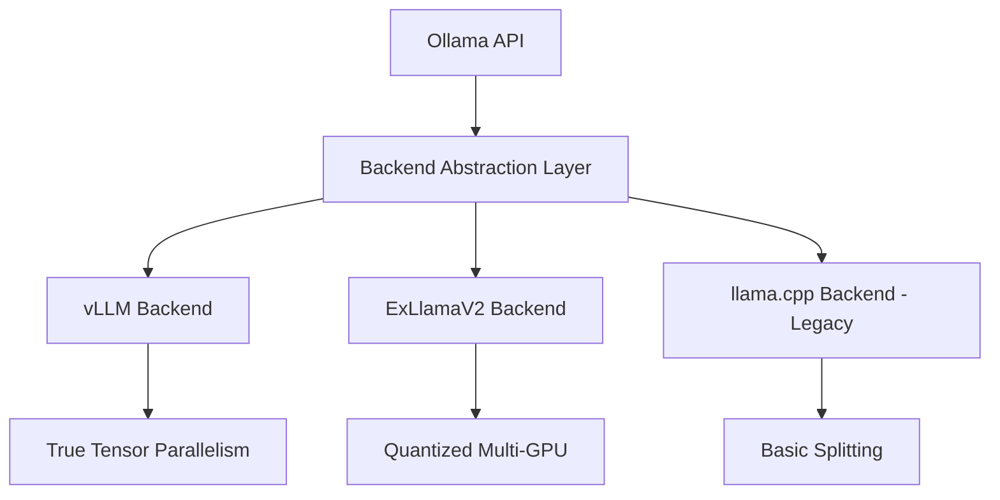

# Multi-GPU Ollama Fork: Comprehensive Development Plan

## Executive Summary

This document outlines a comprehensive plan to fork Ollama and create a multi-GPU optimized version that addresses current limitations in distributed inference and unlocks the full potential of multi-GPU systems. The fork will maintain Ollama's simplicity while adding enterprise-grade multi-GPU capabilities.

## Current State Analysis

### Ollama's Existing Multi-GPU Capabilities

**✅ Current Strengths:**
- Robust GPU discovery and enumeration system
- Basic tensor splitting across GPUs of same type
- Sophisticated memory estimation and tracking
- Support for CUDA, ROCm, OneAPI, and Metal
- Concurrent model loading capabilities

**❌ Critical Limitations:**
- Poor multi-GPU performance due to llama.cpp tensor splitting issues (up to 8x slowdowns)
- No cross-vendor GPU coordination (cannot mix NVIDIA + AMD)
- Limited to memory-based scheduling only
- No pipeline parallelism support
- Sequential bottlenecks in tokenization and batch processing
- Simple tensor splitting without true parallelism

### Performance Baseline

**Current Performance Issues:**
- Batch processing drops from 2400 to 200-300 tokens/sec with multiple GPUs
- GPU utilization typically 40-60% instead of optimal 90%+
- Memory bandwidth limitations not addressed
- No dynamic load balancing

## Fork Objectives

### Primary Goals

1. **True Multi-GPU Parallelism**: Implement tensor and pipeline parallelism that actually improves performance
2. **Cross-Vendor Support**: Enable simultaneous use of NVIDIA, AMD, and Intel GPUs
3. **Advanced Scheduling**: Replace simple memory-based scheduling with performance-aware algorithms
4. **Enterprise Features**: Add dynamic load balancing, model migration, and resource optimization
5. **Backward Compatibility**: Maintain existing API and user experience

### Performance Targets

- **2-4x throughput improvement** with proper tensor parallelism
- **50-70% latency reduction** for large models
- **Support for 400B+ models** across consumer hardware
- **90%+ GPU utilization** vs current 40-60%
- **Cross-vendor GPU coordination** with <10% overhead

## Technical Architecture

### Backend Strategy

Replace llama.cpp dependency with multiple backend options:



### Multi-GPU Parallelism Strategies

#### 1. Tensor Parallelism (TP)
- **Implementation**: Split individual layers across GPUs
- **Use Case**: Models exceeding single GPU memory
- **Optimization**: Column/row parallelism with all-reduce operations
- **Communication**: NCCL for NVIDIA, RCCL for AMD

#### 2. Pipeline Parallelism (PP)
- **Implementation**: Assign different layers to different GPUs
- **Use Case**: Very large models with sequential processing
- **Optimization**: Micro-batching and overlapped communication
- **Staging**: Optimized for prefill vs decode phases

#### 3. Hybrid Parallelism
- **Strategy**: Combine TP and PP based on model size and hardware
- **Configuration**: TP within nodes, PP across nodes
- **Adaptive**: Dynamic strategy selection based on workload

#### 4. Data Parallelism (DP)
- **Implementation**: Replicate models across GPUs for different requests
- **Use Case**: High-throughput scenarios with multiple concurrent requests
- **Load Balancing**: Intelligent request routing

### Advanced Scheduling Architecture

```go
type AdvancedScheduler struct {
    gpuClusters     map[string][]GpuInfo
    loadBalancer    LoadBalancer
    migrationEngine MigrationEngine
    profiler        PerformanceProfiler
    topology        GPUTopology
}

type SchedulingPolicy struct {
    Strategy        ParallelismStrategy
    LoadBalancing   LoadBalanceAlgorithm
    AffinityRules   []AffinityRule
    PowerManagement PowerPolicy
}
```

## Development Phases

### Phase 1: Foundation & Backend Integration (2-3 months)

#### 1.1 Enhanced GPU Discovery (Week 1-2)
**Files to Modify:**
- `discover/gpu.go`
- `discover/types.go`

**New Features:**
- GPU performance benchmarking during discovery
- Cross-vendor GPU coordination support
- GPU topology detection (PCIe lanes, NUMA awareness)
- Power and thermal monitoring capabilities

**Implementation:**
```go
type EnhancedGpuInfo struct {
    discover.GpuInfo
    Benchmark     BenchmarkResults
    Topology      TopologyInfo
    PowerProfile  PowerInfo
    Affinity      []AffinityMapping
}

type CrossVendorManager struct {
    cudaGPUs  []EnhancedGpuInfo
    rocmGPUs  []EnhancedGpuInfo
    intelGPUs []EnhancedGpuInfo
}
```

#### 1.2 Backend Abstraction Layer (Week 3-6)
**New Files:**
- `ml/backend/abstraction.go`
- `ml/backend/vllm/`
- `ml/backend/exllamav2/`

**Implementation:**
```go
type MultiGPUBackend interface {
    Initialize(gpus []EnhancedGpuInfo) error
    LoadModel(model string, config ParallelConfig) error
    Inference(request InferenceRequest) (InferenceResponse, error)
    GetCapabilities() BackendCapabilities
    Migrate(source, target []GpuInfo) error
}
```

**Backend Implementations:**
- **vLLM Backend**: True tensor parallelism implementation
- **ExLlamaV2 Backend**: Quantized multi-GPU inference
- **Enhanced llama.cpp**: Improved tensor splitting (legacy support)

#### 1.3 Advanced Scheduler Foundation (Week 7-8)
**Files to Modify:**
- `server/sched.go`

**New Features:**
- Performance-aware scheduling algorithms
- Multi-policy scheduler support
- Resource topology awareness

### Phase 2: Multi-GPU Parallelism Implementation (3-4 months)

#### 2.1 True Tensor Parallelism (Month 1)
**Implementation Strategy:**
- Replace llama.cpp tensor splitting with vLLM tensor parallelism
- Implement attention and MLP layer splitting
- Add NCCL/RCCL communication optimization
- Support for heterogeneous GPU configurations

**Key Components:**
```go
type TensorParallelConfig struct {
    WorldSize      int
    Rank           int
    GPUMapping     map[int]string
    Communication  CommunicationBackend
    SplitStrategy  SplitStrategy
}
```

#### 2.2 Pipeline Parallelism (Month 2)
**Files to Modify:**
- `runner/llamarunner/runner.go`
- `runner/llamarunner/cache.go`

**Features:**
- Stage-based model partitioning
- Micro-batching implementation
- Overlapped compute and communication
- Optimized prefill vs decode handling

**Architecture:**
```go
type PipelineStage struct {
    StageID    int
    GPUs       []GpuInfo
    Layers     []LayerInfo
    InputChan  chan BatchData
    OutputChan chan BatchData
}
```

#### 2.3 Hybrid Parallelism (Month 3)
**Implementation:**
- Combine tensor and pipeline parallelism
- Dynamic strategy selection based on model and hardware
- Stage-specific optimization (tensor for decode, pipeline for prefill)

### Phase 3: Advanced Features & Optimization (2-3 months)

#### 3.1 Multi-Model Multi-GPU Support (Month 1)
**Capabilities:**
- Run different models on different GPU clusters
- Intelligent model routing based on request type
- Load balancing across model types
- Fallback model hierarchies

**Use Cases:**
- Code generation models on dedicated GPUs
- Reasoning models with specialized hardware
- Lightweight models for simple queries

#### 3.2 Dynamic Resource Management (Month 2)
**Features:**
- Real-time GPU load monitoring
- Automatic model migration based on demand
- Predictive scaling based on request patterns
- GPU power and thermal management

**Components:**
```go
type ResourceManager struct {
    Monitor        GPUMonitor
    Migrator       ModelMigrator
    Predictor      LoadPredictor
    PowerManager   PowerManager
}
```

#### 3.3 Advanced KV Cache Management (Month 3)
**Improvements:**
- Distributed KV cache across multiple GPUs
- Cross-GPU cache coherency protocols
- Cache-aware request routing
- Memory pooling optimization

## Configuration System

### Multi-GPU Configuration Schema

```yaml
# multi_gpu_config.yaml
multi_gpu:
  # Global settings
  enabled: true
  strategy: "hybrid"  # tensor, pipeline, hybrid, data
  
  # Backend configuration
  backends:
    primary: "vllm"
    fallback: "exllamav2"
    legacy: "llama_cpp"
  
  # Tensor parallelism settings
  tensor_parallel:
    size: 4
    communication: "nccl"  # nccl, rccl, gloo
    split_strategy: "balanced"  # balanced, memory_aware, performance_aware
  
  # Pipeline parallelism settings
  pipeline_parallel:
    size: 2
    micro_batch_size: 1
    overlap_communication: true
  
  # Data parallelism settings
  data_parallel:
    replicas: 2
    load_balancing: "round_robin"  # round_robin, least_loaded, performance_aware
  
  # Cross-vendor support
  cross_vendor:
    enabled: true
    cuda_gpus: [0, 1]
    rocm_gpus: [2, 3]
    intel_gpus: [4]
    coordination_overhead: 0.1
  
  # Advanced scheduling
  scheduling:
    algorithm: "performance_aware"  # memory_only, performance_aware, power_aware
    metrics: ["latency", "throughput", "memory", "power"]
    migration:
      enabled: true
      threshold: 0.8
      cooldown: 30
  
  # Memory management
  memory:
    pooling: true
    defragmentation: true
    cross_gpu_sharing: true
    kv_cache_distribution: "balanced"
  
  # Monitoring and optimization
  monitoring:
    enabled: true
    metrics_collection: true
    performance_profiling: true
    auto_optimization: true
```

### Environment Variables

```bash
# Multi-GPU configuration
export OLLAMA_MULTI_GPU=true
export OLLAMA_GPU_STRATEGY=hybrid
export OLLAMA_TENSOR_PARALLEL_SIZE=4
export OLLAMA_PIPELINE_PARALLEL_SIZE=2

# Cross-vendor GPU assignment
export OLLAMA_CUDA_GPUS="0,1"
export OLLAMA_ROCM_GPUS="2,3"
export OLLAMA_INTEL_GPUS="4"

# Performance tuning
export OLLAMA_GPU_MEMORY_POOL=true
export OLLAMA_KV_CACHE_DISTRIBUTION=balanced
export OLLAMA_AUTO_MIGRATION=true

# Backend selection
export OLLAMA_BACKEND=vllm
export OLLAMA_FALLBACK_BACKEND=exllamav2
```

## API Extensions

### New Endpoints

```http
# Multi-GPU status and monitoring
GET /api/multigpu/status
GET /api/multigpu/topology
GET /api/multigpu/performance

# Model management
POST /api/multigpu/migrate
POST /api/multigpu/rebalance
GET /api/multigpu/models

# Configuration
GET /api/multigpu/config
PUT /api/multigpu/config
```

### Extended Generate API

```json
{
  "model": "llama3.1:70b",
  "prompt": "Explain quantum computing",
  "multi_gpu": {
    "strategy": "tensor_parallel",
    "gpu_selection": "auto",
    "performance_profile": "balanced"
  }
}
```

## Performance Optimization Strategies

### Communication Optimization

1. **NCCL Integration**: Optimized all-reduce operations for NVIDIA GPUs
2. **RCCL Support**: AMD GPU communication optimization
3. **Overlap Communication**: Hide communication latency with computation
4. **Compression**: Gradient and activation compression for reduced bandwidth

### Memory Optimization

1. **Memory Pooling**: Shared memory pools across GPUs
2. **Dynamic Allocation**: Just-in-time memory allocation
3. **Garbage Collection**: Proactive memory cleanup
4. **KV Cache Optimization**: Distributed and compressed KV cache

### Compute Optimization

1. **Kernel Fusion**: Combine operations to reduce GPU kernel launches
2. **Mixed Precision**: FP16/BF16 for improved throughput
3. **Quantization**: Support for INT8/INT4 quantized models
4. **Custom Kernels**: Optimized kernels for specific operations

## Testing Strategy

### Performance Benchmarks

```bash
# Throughput benchmarks
ollama benchmark --multi-gpu --strategy=tensor_parallel --gpus=4
ollama benchmark --multi-gpu --strategy=pipeline_parallel --stages=2
ollama benchmark --multi-gpu --strategy=hybrid --tensor-size=2 --pipeline-size=2

# Latency benchmarks
ollama benchmark --latency --multi-gpu --batch-sizes=1,4,16,64
ollama benchmark --latency --model-sizes=7b,13b,30b,70b

# Memory efficiency
ollama benchmark --memory --kv-cache-distribution
ollama benchmark --memory --cross-gpu-sharing
```

### Integration Tests

```go
// Test multi-GPU inference
func TestMultiGPUInference(t *testing.T) {
    config := MultiGPUConfig{
        Strategy: "tensor_parallel",
        GPUs:     []int{0, 1, 2, 3},
    }
    
    client := NewMultiGPUClient(config)
    response := client.Generate("Explain AI")
    
    assert.NotEmpty(t, response)
    assert.True(t, response.Performance.Throughput > baseline)
}
```

## Deployment Strategy

### Docker Support

```dockerfile
# Multi-GPU Ollama container
FROM nvidia/cuda:12.1-devel-ubuntu22.04

# Install ROCm support
RUN apt-get update && apt-get install -y \
    rocm-dev \
    rocm-libs \
    rccl

# Install Intel OneAPI
RUN wget -qO - https://repositories.intel.com/graphics/intel-graphics.key | \
    gpg --dearmor --output /usr/share/keyrings/intel-graphics.gpg

COPY --from=builder /app/ollama-multi-gpu /usr/local/bin/
COPY multi_gpu_config.yaml /etc/ollama/

EXPOSE 11434
CMD ["ollama-multi-gpu", "serve", "--multi-gpu"]
```

### Kubernetes Deployment

```yaml
apiVersion: apps/v1
kind: Deployment
metadata:
  name: ollama-multi-gpu
spec:
  replicas: 1
  template:
    spec:
      containers:
      - name: ollama-multi-gpu
        image: ollama/ollama-multi-gpu:latest
        resources:
          limits:
            nvidia.com/gpu: 4
            amd.com/gpu: 2
        env:
        - name: OLLAMA_MULTI_GPU
          value: "true"
        - name: OLLAMA_GPU_STRATEGY
          value: "hybrid"
```

## Migration and Compatibility

### Backward Compatibility

1. **API Compatibility**: All existing endpoints continue to work
2. **Model Format**: Support for existing GGUF models
3. **Configuration**: Existing environment variables honored
4. **Gradual Migration**: Feature flags for gradual adoption

### Migration Path

```bash
# Step 1: Install multi-GPU version
curl -fsSL https://ollama.com/install-multi-gpu.sh | sh

# Step 2: Enable multi-GPU features
ollama config set multi_gpu.enabled true

# Step 3: Configure GPU strategy
ollama config set multi_gpu.strategy hybrid

# Step 4: Migrate existing models
ollama migrate-models --multi-gpu
```

## Monitoring and Observability

### Performance Metrics

```go
type PerformanceMetrics struct {
    Throughput     float64 `json:"throughput"`     // tokens/sec
    Latency        float64 `json:"latency"`        // ms
    GPUUtilization []float64 `json:"gpu_util"`     // per GPU %
    MemoryUsage    []int64 `json:"memory_usage"`   // bytes per GPU
    PowerDraw      []float64 `json:"power_draw"`   // watts per GPU
    Temperature    []float64 `json:"temperature"`  // celsius per GPU
}
```

### Monitoring Dashboard

- Real-time GPU utilization graphs
- Memory usage tracking across all GPUs
- Request latency and throughput metrics
- Model distribution visualization
- Performance optimization recommendations

## Security Considerations

### Multi-GPU Security

1. **GPU Isolation**: Ensure proper GPU memory isolation between models
2. **Cross-Vendor Security**: Secure communication between different GPU types
3. **Resource Limits**: Prevent resource exhaustion attacks
4. **Model Isolation**: Secure model loading and unloading

### Network Security

1. **Encrypted Communication**: TLS for multi-node communication
2. **Authentication**: Secure API access for multi-GPU operations
3. **Resource Quotas**: Per-user GPU resource limits

## Cost Analysis

### Development Costs

- **Phase 1**: 2-3 months, 2-3 senior engineers
- **Phase 2**: 3-4 months, 3-4 senior engineers
- **Phase 3**: 2-3 months, 2-3 senior engineers
- **Total**: 7-10 months, estimated $500K-800K development cost

### Hardware Requirements for Testing

- **Multi-vendor setup**: 4x NVIDIA RTX 4090, 4x AMD RX 7900 XTX
- **High-memory setup**: 2x NVIDIA H100 80GB or A100 80GB
- **Consumer setup**: 4x RTX 4080/4090 for consumer testing
- **Total hardware cost**: $50K-100K

### Expected ROI

- **Performance gains**: 2-4x throughput improvement
- **Hardware utilization**: 90%+ vs current 40-60%
- **Market differentiation**: First true multi-GPU Ollama implementation
- **Enterprise adoption**: Target 1000+ enterprise users in first year

## Risk Assessment

### Technical Risks

1. **Backend Integration Complexity**: Medium risk
   - Mitigation: Phased rollout with fallback to llama.cpp

2. **Cross-Vendor Compatibility**: High risk
   - Mitigation: Extensive testing on multiple hardware configurations

3. **Performance Regressions**: Medium risk
   - Mitigation: Comprehensive benchmarking and testing

### Business Risks

1. **Upstream Changes**: Ollama team may implement similar features
   - Mitigation: Contribute changes back to upstream, maintain as enhancement

2. **Hardware Compatibility**: Medium risk
   - Mitigation: Support matrix for tested configurations

## Success Metrics

### Technical KPIs

- **Throughput Improvement**: Target 2-4x vs baseline
- **GPU Utilization**: Target >90% across all GPUs
- **Latency Reduction**: Target 50-70% for large models
- **Memory Efficiency**: Support 2x larger models than single GPU

### Adoption KPIs

- **GitHub Stars**: Target 5K+ stars within 6 months
- **Downloads**: Target 10K+ downloads per month
- **Enterprise Adoption**: Target 100+ enterprise users
- **Community Contributions**: Target 50+ contributors

## Conclusion

This comprehensive plan outlines the development of a multi-GPU optimized fork of Ollama that addresses current limitations and unlocks the full potential of multi-GPU systems. The phased approach ensures manageable development complexity while delivering incremental value.

The fork will maintain Ollama's ease of use while adding enterprise-grade multi-GPU capabilities, positioning it as the premier solution for high-performance LLM inference on multi-GPU systems.

**Key Differentiators:**
- True multi-GPU parallelism (not just splitting)
- Cross-vendor GPU support (NVIDIA + AMD + Intel)
- Advanced scheduling and load balancing
- Enterprise-grade monitoring and management
- Backward compatibility with existing Ollama ecosystem

**Timeline**: 7-10 months from conception to production-ready release
**Investment**: $500K-800K development + $50K-100K hardware
**Expected Return**: Market-leading multi-GPU inference platform with significant performance advantages

---

*This plan represents a comprehensive roadmap for creating the most advanced multi-GPU LLM inference platform available, building on Ollama's solid foundation while addressing its current limitations.*